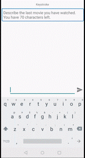
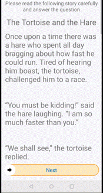
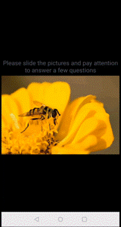
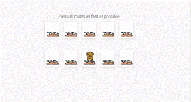
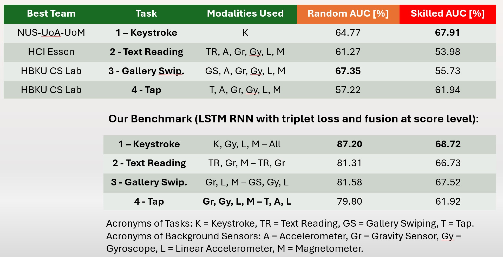

# Mobile Behavioral Biometrics on BehavePassDB 

This repository contains the source code of the experiments reported in [1]. It is possible to train, validate and test the models considering the evaluation protocol of the [Mobile Behavioral Biometrics Competition (MobileB2C)](https://sites.google.com/view/mobileb2c/) that was held at the International Joint Conference on Biometrics (IJCB) 2022 [2]. 

A graphical visualization of the mobile behavioral tasks in the competition is available below.

   

The models provided in this repo achieve first place on the benchmark, based on the novel BehavePassDB, collected by the [BiDA-Lab at the Universidad Autónoma de Madrid (UAM)](https://bidalab.eps.uam.es/). 



# Repo Description
In this repository, we provide the source code for all aspects of the paper, including:
- The `preprocess.py` script converts the raw BehavePassDB data (available [here](https://bidalab.eps.uam.es/listdatabases?id=MobileB2C_BehavePassDB#page) for download) in a format ready to be processed by the models.
- The scripts to train and validate the models (`train_background_sensors.py` for accelerometer, lin. accelerometer, gyroscope, magnetometer, gravity sensor; `train_touch.py` is for touch gestures during text reading, gallery swiping, and tapping tasks, `train_keystroke.py` is for the keystroke task). First it is necessary to configure the training in `utils/config.py`. 
- The `read_logs.py` script plots the EER, AUC, and loss for the training and validation sets along the epochs.
- The `test.py` script creates the data in a format ready to be submitted to [CodaLab](https://codalab.lisn.upsaclay.fr/competitions/3564) for scoring.
- Pretrained models (LSTM RNN trained with triplet loss).

# Useful resources

- Website: https://sites.google.com/view/mobileb2c/
- CodaLab: https://codalab.lisn.upsaclay.fr/competitions/3564

# References

[\[1\] *Stragapede, G., Vera-Rodriguez, R., Tolosana, R., & Morales, A. (2023). BehavePassDB: public database for mobile behavioral biometrics and benchmark evaluation. Pattern Recognition, 134, 109089.*](https://ieeexplore.ieee.org/abstract/document/10042710) [**\[arXiv\]**](https://arxiv.org/abs/2206.02502)

[\[2\] *Stragapede, G., Vera-Rodriguez, R., Tolosana, R., Morales, A., Fierrez, J., Ortega-Garcia, J., ... & Jabin, S. (2022, October). IJCB 2022 mobile behavioral biometrics competition (MobileB2C). In 2022 IEEE International Joint Conference on Biometrics (IJCB) (pp. 1-7). IEEE.*](https://ieeexplore.ieee.org/abstract/document/10042710) [**\[arXiv\]**](https://arxiv.org/abs/2210.03072)


If you use any of the parts of this repo, please cite: 

```

@article{stragapede2023behavepassdb,
  title={BehavePassDB: public database for mobile behavioral biometrics and benchmark evaluation},
  author={Stragapede, Giuseppe and Vera-Rodriguez, Ruben and Tolosana, Ruben and Morales, Aythami},
  journal={Pattern Recognition},
  volume={134},
  pages={109089},
  year={2023},
  publisher={Elsevier}
}

@inproceedings{stragapede2022ijcb,
  title={IJCB 2022 mobile behavioral biometrics competition (MobileB2C)},
  author={Stragapede, Giuseppe and Vera-Rodriguez, Ruben and Tolosana, Ruben and Morales, Aythami and Fierrez, Julian and Ortega-Garcia, Javier and Rasnayaka, Sanka and Seneviratne, Sachith and Dissanayake, Vipula and Liebers, Jonathan and others},
  booktitle={2022 IEEE International Joint Conference on Biometrics (IJCB)},
  pages={1--7},
  year={2022},
  organization={IEEE}
}


```


This work is the outcome of a research project with Orange Labs (France) called "BehavePass: Behavioral Biometrics for Continuous Authentication". 